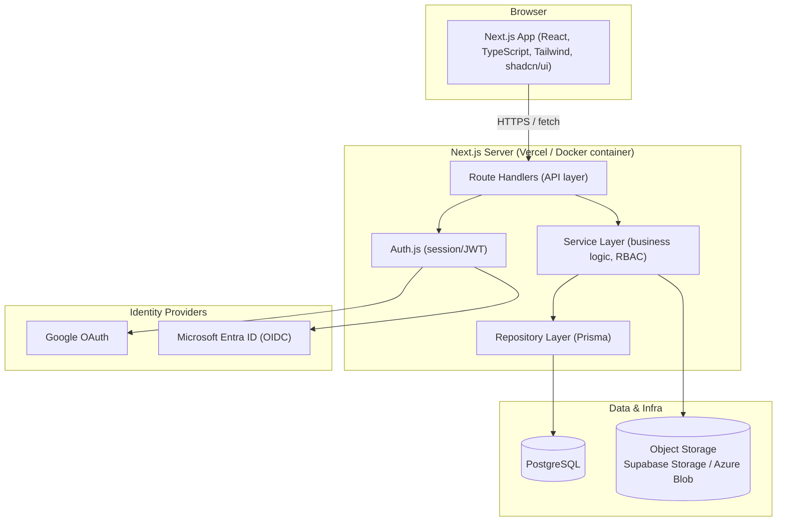
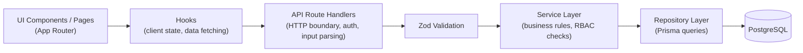

# Software Architecture — EAGLES V1

**Status:** Draft v1.0 · **Owner:** Founding CTO · **Last Updated:** 2026-07-10

Related: `02_Feature_Architecture.md`, `03_Technology_Stack.md`,
`04_Coding_Standards.md`, ADRs in `docs/11_ADR/`.

---

## 1. Architectural Style

EAGLES V1 is a **modular monolith**: a single Next.js application containing
both the UI and the backend (via Route Handlers), organized internally by
**feature**, not by technical layer. This is deliberate:

- A 2-founder team cannot operate a microservices topology (multiple
  deploys, service discovery, distributed tracing) at this stage.
- A modular monolith with clean internal boundaries (feature modules, a
  repository pattern, a service layer) gives 90% of the maintainability
  benefit of microservices with a fraction of the operational cost.
- If a specific module later needs independent scaling (e.g., notifications,
  search), it can be extracted because the internal boundary already exists
  — see ADR-0001.

## 2. High-Level System Diagram

## 3. Layering Within the Application

Every feature module is internally layered the same way (see
`02_Feature_Architecture.md` for the folder layout):

**Rule:** Route Handlers never call Prisma directly. Route Handlers call
Services. Services call Repositories. This keeps business logic testable
without spinning up HTTP, and keeps Prisma usage confined to one layer so the
ORM can be swapped or the DB provider changed without touching business
logic (see NFR-8 in the PRD).

## 4. Request Lifecycle (example: create an Issue)

1. Client submits a form validated client-side with the same Zod schema used
   server-side (`features/issues/validation/create-issue.schema.ts`).
2. Route Handler `POST /api/projects/[projectId]/issues` receives the
   request, resolves the session via Auth.js, re-validates the payload with
   Zod.
3. Route Handler calls `IssueService.create(input, actor)`.
4. `IssueService` checks RBAC (actor must be a member of the project with at
   least `MEMBER` role), applies business rules (FR-3 in the PRD), and calls
   `IssueRepository.create(...)`.
5. `IssueRepository` performs the Prisma insert, stamping audit fields
   (`createdBy`, `createdAt`).
6. Service triggers side effects (notification to assignee) via
   `NotificationService`, itself called through its own service interface —
   features communicate through service interfaces, never by importing each
   other's repositories directly.
7. Response DTO (not the raw Prisma model) is returned to the client.

## 5. Cross-Feature Communication Rule

Features may depend on another feature's **service interface** (e.g.,
`issues` calls `notifications`' service to enqueue a notification) but must
never import another feature's repository, Prisma models directly, or UI
components. This is the seam that would allow extracting a feature into a
separate service later without an application-wide rewrite.

## 6. Multi-Tenancy Posture (V1 → V2)

V1 is single-tenant in practice (one company) but the schema includes an
`Organization` entity and every tenant-scoped table carries an
`organizationId` foreign key from day one (see ADR-0001 and
`docs/03_Database/*`, authored in Phase 2). This means V2's SaaS
transition is a matter of (a) allowing multiple `Organization` rows and (b)
adding tenant-aware routing/billing — not a schema migration across every
table.

## 7. Deployment Topology

| Environment | Frontend/Backend | Database | Storage | Notes |
|---|---|---|---|---|
| Local dev | `next dev` or Docker Compose | PostgreSQL container | Local disk / MinIO (optional) | No cloud dependency required |
| Development (hosted) | Vercel | Supabase PostgreSQL | Supabase Storage | Free/low tier, < $40/mo |
| Production (initial) | Vercel | Supabase PostgreSQL (paid tier) | Supabase Storage | < $100/mo target |
| Production (future) | Docker containers on Azure App Service / Container Apps | Azure Database for PostgreSQL | Azure Blob Storage | Portability validated by Docker Compose parity in dev (ADR-0004) |

## 8. Why Not (Today)

- **Microservices:** operational overhead not justified at this team size or
  user scale (60 concurrent users, 500 total).
- **Separate SPA + API server:** Next.js Route Handlers give us one deploy
  unit, one repo, shared types between client and server — critical for a
  small team.
- **NoSQL:** the domain (projects, issues, sprints, users, roles) is
  strongly relational; PostgreSQL with Prisma is the correct default.
- **GraphQL:** REST-style Route Handlers + typed fetch wrappers are simpler
  to reason about for this team; revisit only if a documented need (e.g., a
  public API in V2) justifies the added complexity.
