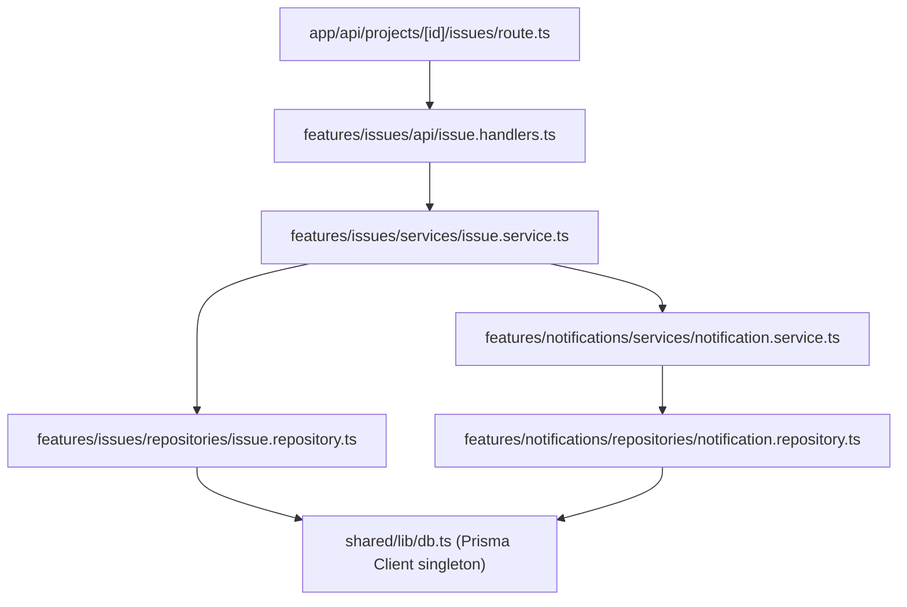

# Feature Architecture — EAGLES V1

**Status:** Draft v1.0 · **Owner:** Founding CTO · **Last Updated:** 2026-07-10

---

## 1. Principle

**Feature-first, never layer-first.** Code is organized around what the
product does (`projects`, `issues`, `board`, `notifications`) rather than
what technical role it plays (`controllers/`, `models/`, `views/`). Every
feature owns its full vertical slice.

## 2. Repository Layout (target — created in Phase 3)

```
project-atlas/
├── src/
│   ├── app/                        # Next.js App Router — routing only, no business logic
│   │   ├── (auth)/                 # sign-in, sign-out pages
│   │   ├── (app)/                  # authenticated app shell (sidebar layout)
│   │   │   ├── dashboard/
│   │   │   ├── projects/[projectId]/
│   │   │   │   ├── board/
│   │   │   │   ├── backlog/
│   │   │   │   └── settings/
│   │   │   └── admin/
│   │   └── api/                    # Route Handlers — thin, delegate to feature services
│   │       ├── auth/[...nextauth]/
│   │       ├── projects/
│   │       ├── issues/
│   │       └── ...
│   ├── features/                   # ALL business logic lives here, one folder per feature
│   │   ├── authentication/
│   │   │   ├── components/
│   │   │   ├── hooks/
│   │   │   ├── services/
│   │   │   ├── repositories/
│   │   │   ├── validation/
│   │   │   └── types/
│   │   ├── dashboard/
│   │   ├── projects/
│   │   ├── issues/
│   │   ├── board/
│   │   ├── backlog/
│   │   ├── sprint/
│   │   ├── comments/
│   │   ├── attachments/
│   │   ├── notifications/
│   │   ├── reports/
│   │   ├── search/
│   │   ├── admin/
│   │   ├── user-management/
│   │   ├── roles/
│   │   └── profile/
│   ├── shared/                     # Cross-feature, non-business-logic utilities
│   │   ├── components/ui/          # shadcn/ui primitives
│   │   ├── lib/                    # db client, auth config, storage adapter, logger
│   │   └── types/
│   └── prisma/
│       └── schema.prisma
├── docs/
├── diagrams/
├── templates/
├── assets/
├── docker/
└── .github/workflows/
```

## 3. Anatomy of a Feature Folder

Using `features/issues/` as the reference example:

| Folder | Responsibility | Example |
|---|---|---|
| `components/` | React components specific to this feature | `IssueCard.tsx`, `IssueDetailPanel.tsx` |
| `hooks/` | Client-side data fetching/state (React Query-style hooks) | `useIssue.ts`, `useCreateIssue.ts` |
| `services/` | Server-side business logic, RBAC enforcement, orchestration | `issue.service.ts` |
| `repositories/` | Prisma queries only — no business logic | `issue.repository.ts` |
| `validation/` | Zod schemas, shared between client and server | `create-issue.schema.ts` |
| `types/` | Feature-local TypeScript types/DTOs | `issue.types.ts` |
| `api/` | Route Handler logic re-exported for the `app/api` route to call (keeps `app/` thin) | `issue.handlers.ts` |

## 4. Rules Enforced by This Architecture

1. **Route Handlers are thin.** `src/app/api/**/route.ts` files only:
   resolve session, call a feature's handler/service, return the response.
   No Prisma imports in `app/`.
2. **Repositories are the only place Prisma is imported.** This is what
   makes NFR-8 (portability) achievable — swapping the ORM or adding a
   caching layer touches one folder per feature, not the whole app.
3. **Services enforce RBAC and business rules.** Never trust the client;
   never assume the caller is authorized. Every service method receives an
   `actor` (the authenticated user + role context) and checks permissions
   before mutating.
4. **Cross-feature calls go through services, never repositories.** E.g.
   `issues` feature calling into `notifications` feature imports
   `NotificationService`, never `notification.repository.ts`.
5. **No duplicate logic.** Shared, non-feature-specific code (DB client
   singleton, Auth.js config, the storage adapter interface, logger) lives
   in `shared/lib/`, imported by every feature.
6. **Validation schemas are the single source of truth for a shape.** The
   Zod schema used to validate a create-issue API request is the same
   schema used to type the create-issue form with React Hook Form
   (`zodResolver`).

## 5. Naming Conventions

- Files: `kebab-case.ts` / `PascalCase.tsx` for components.
- Services: `<entity>.service.ts`, exporting a class or object
  `<Entity>Service`.
- Repositories: `<entity>.repository.ts`, exporting `<Entity>Repository`.
- Zod schemas: `<action>-<entity>.schema.ts`, e.g. `create-issue.schema.ts`.
- DTOs returned from services are explicit types in `types/`, never the raw
  Prisma model (prevents leaking internal fields like `deletedAt` to the
  client by accident).

## 6. Example Dependency Direction



Note the `issues` feature never imports `notification.repository.ts`
directly — only `NotificationService`.
