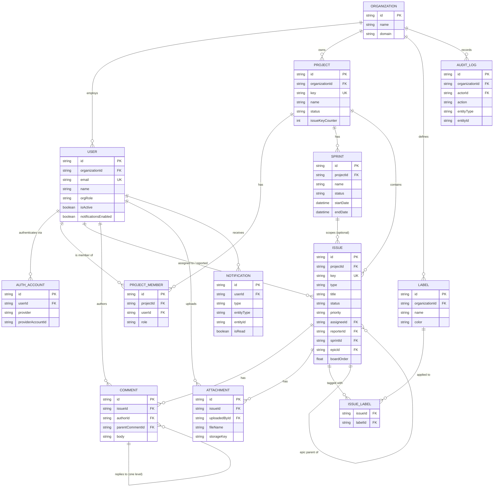

# Entity-Relationship Diagram — EAGLES V1

**Status:** Draft v1.0 · **Owner:** Founding CTO · **Last Updated:** 2026-07-10

Companion to `01_Database_Design.md` — field-level detail lives there; this
is the visual relationship map. Audit fields (`createdAt`, `updatedAt`,
`createdBy`, `updatedBy`, `deletedAt`) are omitted below for readability —
assume every entity has them except `AuditLog` and `IssueLabel`/`AuthAccount`
(see `01_Database_Design.md §1`).

## Notes on Reading This Diagram

- `ISSUE ||--o{ ISSUE : "epic parent of"` is a self-relation: an `Issue` of
  type `EPIC` can be the parent of many other issues via `Issue.epicId`.
- `NOTIFICATION.entityId` is intentionally not drawn as a typed FK to a
  single table — it's polymorphic (`entityType` says which table `entityId`
  refers to), documented in `01_Database_Design.md §2.12`.
- This diagram is the source that `diagrams/er-diagram.mmd` mirrors for
  reuse outside this doc, per `diagrams/README.md`.
