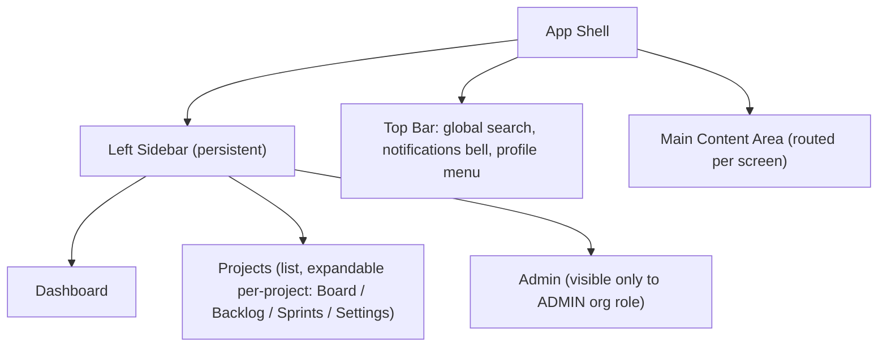

# Screens & Information Architecture — EAGLES V1

**Status:** Draft v1.0 · **Owner:** Founding CTO · **Last Updated:** 2026-07-10

Applies the direction in `01_UI_Design_Principles.md` to the concrete
screen list implied by the PRD modules. Per-module interaction detail is
owned by each `docs/02_Modules/*.md §UI`; this doc is the shared shell,
navigation, and screen inventory so every module doc references the same
structure instead of each inventing its own.

---

## 1. App Shell

- Sidebar is collapsible (icon-only mode) — persistent across all
  authenticated routes, per `src/app/(app)/` layout in the Feature
  Architecture.
- Top bar houses the three things needed from anywhere: search (PRD FR-6),
  notifications (PRD FR-5), and account/profile access.

## 2. Screen Inventory

| # | Screen | Route (indicative) | Primary module doc |
|---|---|---|---|
| 1 | Sign in | `/sign-in` | `01_authentication.md` |
| 2 | Dashboard | `/dashboard` | `02_dashboard.md` |
| 3 | Project list | `/projects` | `03_projects.md` |
| 4 | Project settings | `/projects/:id/settings` | `03_projects.md` |
| 5 | Issue detail (panel or full page) | `/projects/:id/issues/:issueKey` | `04_issues.md` |
| 6 | Board | `/projects/:id/board` | `05_board.md` |
| 7 | Backlog | `/projects/:id/backlog` | `06_backlog.md` |
| 8 | Sprint planning / active sprint header | within Backlog & Board | `07_sprint.md` |
| 9 | Issue comments (panel section) | within Issue detail | `08_comments.md` |
| 10 | Attachments (panel section) | within Issue detail | `09_attachments.md` |
| 11 | Notifications panel | top-bar dropdown + `/notifications` | `10_notifications.md` |
| 12 | Reports | `/projects/:id/reports` | `11_reports.md` |
| 13 | Global search results | top-bar overlay + `/search` | `12_search.md` |
| 14 | Admin — org settings | `/admin` | `13_admin.md` |
| 15 | Admin — user management | `/admin/users` | `14_user_management.md` |
| 16 | Roles (role pickers embedded in Project Settings & Admin, no standalone screen) | n/a | `15_roles.md` |
| 17 | Profile & notification preferences | `/profile` | `16_profile.md` |

## 3. Core Interaction Patterns (apply across screens)

- **Issue detail** opens as a slide-over panel from Board/Backlog list rows
  (keeps board context visible per Apple-style continuity — no full page
  navigation just to check one issue), with a "expand to full page" escape
  hatch for deep work/permalinks.
- **Board columns** (`TODO / IN_PROGRESS / IN_REVIEW / DONE`) support
  drag-and-drop with the fractional `boardOrder` reordering from
  `docs/04_API/openapi.yaml` `PATCH /issues/{id}/rank`, animated per
  `01_UI_Design_Principles.md §4`.
- **Destructive actions** (delete issue, remove member, close sprint) use
  the toast+Undo pattern from `01_UI_Design_Principles.md §5`, never a
  blocking native `confirm()` dialog.
- **Empty states** (no projects yet, empty backlog) are designed
  deliberately — a short explanation + single clear primary action — not a
  blank screen.

## 4. Component Inventory (mapped to shadcn/ui primitives)

| UI Need | shadcn/ui primitive |
|---|---|
| Buttons, icon buttons | `button` |
| Issue/project forms | `form` + `input`/`textarea`/`select` (React Hook Form + Zod resolver) |
| Issue detail panel | `sheet` |
| Confirmation-free destructive actions | `sonner` (toast) with an Undo action button |
| Board columns / drag containers | `card` inside a custom drag layer (Framer Motion + `@dnd-kit` or equivalent, decided in Phase 3) |
| Notifications dropdown | `dropdown-menu` |
| Global search overlay | `command` (command-palette style, consistent with Apple's spotlight-like feel) |
| Role/status pickers | `select` / `combobox` |
| Avatars | `avatar` |
| Data tables (admin user list, reports) | `table` |

## 5. Theming Tokens (implements `01_UI_Design_Principles.md §2-3`)

| Token | Light (default) value |
|---|---|
| `--background` | `#FFFFFF` |
| `--surface` (cards/panels) | `#FAFAFA` |
| `--foreground` (primary text) | `#1D1D1F` |
| `--border` | `#E5E5EA` |
| `--accent` (primary actions/links/focus) | single brand accent — exact hex to be chosen by founders before Phase 3 (placeholder: `#0A84FF`, Apple's system blue, until a brand color is confirmed) |
| Status colors | small, distinct set for `TODO`/`IN_PROGRESS`/`IN_REVIEW`/`DONE` — muted, never a full-bleed background fill (Design Principles §2) |

Dark-mode token values are deferred to when/if dark mode is actually built
(secondary priority per Design Principles §2).

## 6. Open Items Before Phase 3

- Confirm the accent/brand color (placeholder above).
- Confirm rich text vs. Markdown editor component for issue
  description/comments (affects both this doc and `03_Database` §6).
