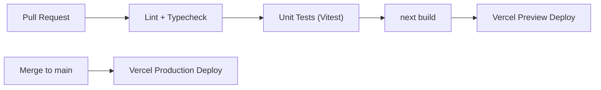

# Infrastructure Overview — EAGLES V1

**Status:** Draft v1.0 · **Owner:** Founding CTO · **Last Updated:** 2026-07-10

Full Docker/CI implementation details land with Phase 3; this document
fixes the target topology and cost model so Phase 3 has a spec to build to.

---

## 1. Environments

| Environment | Purpose | Compute | Database | Storage |
|---|---|---|---|---|
| Local | Day-to-day development | Docker Compose (`docker/docker-compose.yml`) running the Next.js app + Postgres | Postgres container | Local volume (or MinIO container for S3-compatible parity) |
| Development (shared) | Founders/early testers | Vercel (Preview/Dev deployment) | Supabase PostgreSQL (free/low tier) | Supabase Storage |
| Production (initial) | Internal company GA | Vercel (Production deployment) | Supabase PostgreSQL (paid tier sized for 500 users) | Supabase Storage |
| Production (future) | Company-controlled infra | Docker containers on Azure App Service or Container Apps | Azure Database for PostgreSQL Flexible Server | Azure Blob Storage |

## 2. Why Docker Compose Exists Even Though V1 Deploys to Vercel

Docker Compose is not optional tooling — it is the **portability contract**.
Every feature must run correctly in `docker compose up` locally. This is
what lets us credibly promise "Azure deployable" without having built and
tested that path yet: if it runs correctly in Docker locally against a
containerized Postgres, the Azure migration is a hosting change, not an
application change.

## 3. CI/CD Pipeline (GitHub Actions, implemented in Phase 3)



- `lint-and-test.yml`: runs on every PR — ESLint, `tsc --noEmit`, Vitest.
- `build.yml`: runs `next build` to catch build-time errors before merge.
- Deploys are handled by Vercel's GitHub integration (auto preview per PR,
  auto production deploy on merge to `main`).

## 4. Configuration & Secrets

- All environment-specific values (`DATABASE_URL`, `NEXTAUTH_SECRET`,
  `GOOGLE_CLIENT_ID/SECRET`, `AZURE_AD_CLIENT_ID/SECRET`,
  `SUPABASE_URL/KEY`) are supplied via environment variables, validated at
  process startup with a Zod-parsed schema (`shared/lib/env.ts`, Phase 3).
- Local secrets live in a git-ignored `.env.local`; hosted secrets are set
  in Vercel/Azure's respective secret stores — never committed.
- **Two Postgres connection strings, not one**: `DATABASE_URL` (pooled —
  Supabase's PgBouncer connection on port 6543) is used at runtime, since
  Vercel's serverless functions open far more short-lived connections than
  a normal server and a direct connection exhausts Supabase's connection
  limit quickly. `DIRECT_URL` (unpooled, port 5432) is used only by
  `prisma migrate`, since PgBouncer's transaction pooling breaks the
  session-level locking migrations rely on. Both point at the same
  Postgres instance in local Docker Compose (no pooler in front of it
  there). See `prisma/schema.prisma`'s `datasource` block.
- `package.json`'s `postinstall` script runs `prisma generate` — required
  so Vercel's build (which only runs `npm install` then the build command)
  actually has a generated Prisma Client available; CI runs it as an
  explicit step for the same reason.

## 4b. Scheduler (ADR-0051)

Recurring issues need something to fire them. That something is a plain HTTP
endpoint, not a platform primitive:

```
POST /api/scheduler/tick
Authorization: Bearer $SCHEDULER_SECRET
```

Hourly is the intended cadence. **Any** scheduler can call it — a Vercel
`crons` entry, a Kubernetes CronJob, a systemd timer, a GitHub Actions
schedule — which is the point: an app that depends on one host's cron product
is an app that cannot move (ADR-0004).

Properties worth knowing before wiring it up:

- **Idempotent.** Each due recurrence is claimed with a conditional update, so
  overlapping ticks create one issue between them and a retry after a timeout is
  safe. Calling it more often than hourly is harmless, just wasted queries.
- **Cheap when idle.** One indexed read on `recurring_issues.nextRunAt`, which
  is almost every tick.
- **Never backfills.** However long it has been down, one tick creates at most
  one issue per recurrence.
- **Fails closed.** While `SCHEDULER_SECRET` is unset the endpoint refuses
  everything — an unauthenticated scheduler is an unauthenticated issue factory.

On Vercel:

```json
{ "crons": [{ "path": "/api/scheduler/tick", "schedule": "0 * * * *" }] }
```

Vercel Cron issues a **`GET`**, not a POST, and adds
`Authorization: Bearer $CRON_SECRET` itself when that variable is set. The route
therefore answers both verbs with the same auth, and accepts `CRON_SECRET` as an
alias for `SCHEDULER_SECRET` — so a Vercel deployment sets **one** variable and
adds the `crons` entry above, with nothing else to keep in sync. Anywhere else,
set `SCHEDULER_SECRET` and POST it.

**This is not wired up yet** — it is tracked as go-live blocker GL-10, and until
it is done recurrences are configured and inert, with a stale "next run" on the
settings row as the only symptom (REC-4).

## 5. Observability (V1 baseline)

- Structured logging (JSON) from the service layer, shippable to any log
  sink (Vercel's built-in log drain in dev/initial prod; Azure Monitor once
  migrated).
- `AuditLog` table (see Security doc) doubles as a business-event audit
  trail, distinct from operational logs.
- Health check endpoint (`/api/health`) verifying DB connectivity, used by
  container orchestration liveness checks in the Docker/Azure path.

## 6. Cost Model

| Item | Development | Initial Production |
|---|---|---|
| Vercel | Hobby/Pro as needed — target $0–20/mo | Pro tier as needed — target < $40/mo |
| Supabase | Free tier | Paid tier sized to 500 users/DB size — target < $50/mo |
| Domain/misc | ~$0–5/mo (existing) | ~$5–10/mo |
| **Target total** | **< $40/month** | **< $100/month** |

Cost is revisited every phase; if Supabase/Vercel usage approaches these
ceilings, the Azure/Docker path is pulled forward rather than absorbing
uncontrolled SaaS cost growth.

## 7. Future Azure Path (V2 trigger, not V1 work)

1. Provision Azure Database for PostgreSQL Flexible Server; migrate via
   `pg_dump`/`pg_restore` (standard Postgres, no Supabase-specific lock-in
   per ADR-0004).
2. Provision Azure Blob Storage; point the `StorageAdapter` at the Azure
   implementation (interface already provider-agnostic).
3. Build the existing `Dockerfile` and deploy to Azure App Service for
   Containers or Azure Container Apps.
4. Point company DNS (internal domain) at the new deployment; decommission
   the Vercel/Supabase environment once validated.
